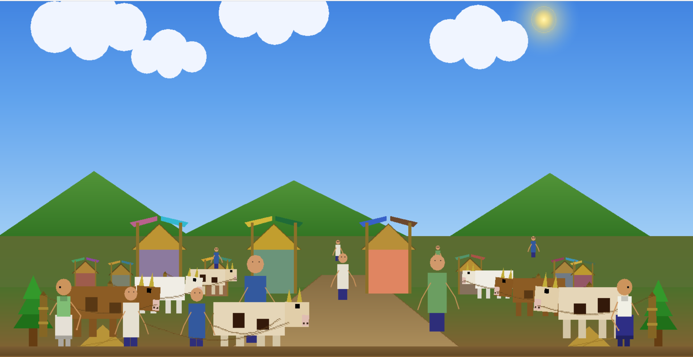
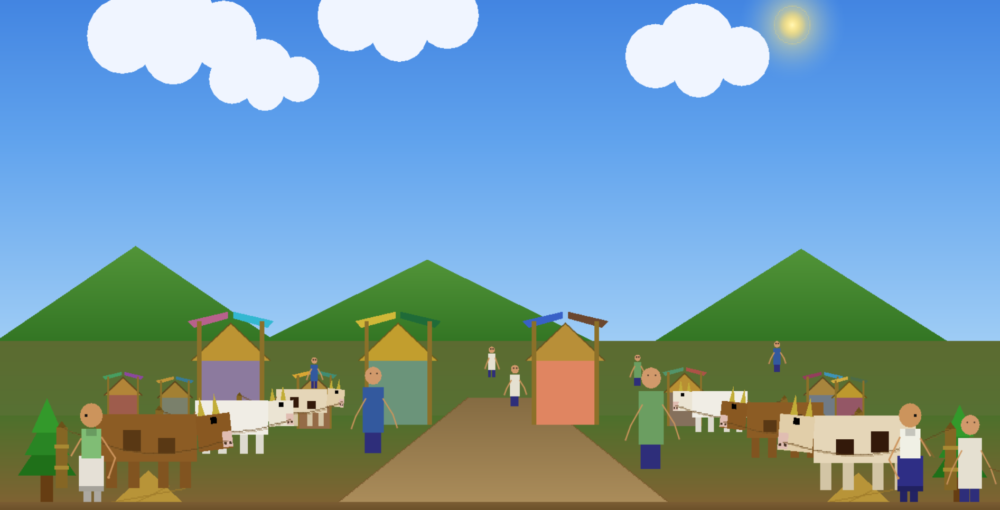

# Gorur Haat, Computer Graphics Lab project

This project was developed under **Computer Graphics Lab (CSE422)**.

OpenGL/FreeGLUT Computer Graphics Lab project in C++ that visualizes a Bangladeshi Eid cattle market scene (`Gorur Haat`) with stalls, cows, people, a central walkway, hills, sky, clouds, and a static daylight sun.

## Features
- **Graphics primitives**: points, lines, polygons, quads, triangles
- **Algorithms**:
  - DDA line algorithm
  - Bresenham line algorithm
  - Midpoint circle algorithm
- **2D transformations**: translation, rotation, scaling, reflection
- **Animation**: clouds, walkers, bargaining gestures, cow idle motion, walking cow with leaders
- **Scene composition**: depth illusion using translation + scaling (far objects smaller/higher)

## Technical details
- **Rendering pipeline**: `display()` draws back-to-front (sky → sun → clouds → ground/path → hills → stalls → cattle rows → crowd/walkers → foreground).
- **Coordinate system**: 2D orthographic projection via `glOrtho(...)` with a cropped Y range (`VIEW_ORTHO_BOTTOM/TOP`) to “zoom” the camera.
- **Depth illusion**: `perspectiveFootPosition(depth, side, outX, outY, outScale)` maps normalized depth to Y position + uniform scale (far objects smaller and higher).
- **Animation loop**: `glutTimerFunc(16, timer, 0)` updates phases and offsets, then `glutPostRedisplay()` (~60 FPS).
- **Algorithm usage in scene**:
  - **DDA**: path edge guides + drooping rope segments (multiple short DDA lines along a sag curve)
  - **Bresenham**: stall roof ridge lines
  - **Midpoint circle**: sun ring sparkle/corona

## Screenshots

<!-- Paths are relative to this README. Use `./assets/...` so editors resolve from the repo root. -->

  
    
  

## Notes
- The sun is intentionally **static** (fixed `SUN_DISK_CENTER_X/Y`) for a natural distant-light effect.

